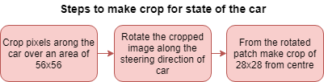
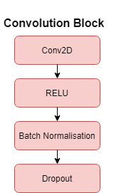
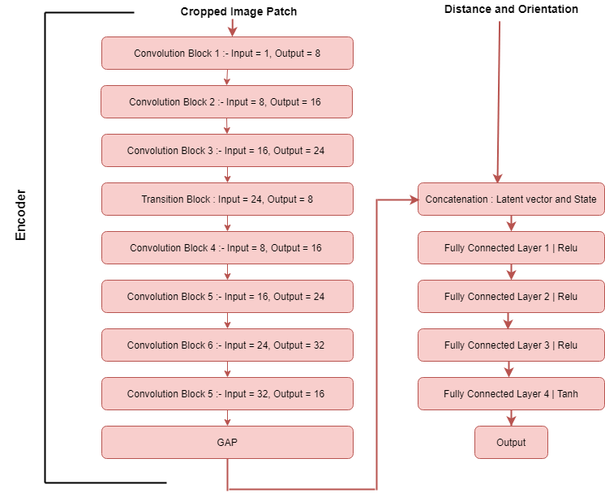

# Self Driving Car Simulation | Reinforcement Learning using Twin Delayed DDPG

## Problem Statement : Create a self driving car simulation game using pygame and run T3D on top of it.

## Project Video :

## Code Base Overview:

First I tried to create custom gym environment using pygame to train the model in colab but the exectuion time was very high thus created two files as follows :

* gym_game : Failed attempt to create custom Car environment. Need to fix it 
* AI.py : Contains the TD3 Implementation including Actor-Critic models and Replay buffer
* Car_Train.py : Training the TDR for self driving car simulation
* Car_Inference : Inference code
* Train.ipynb : Training code to run on colab

Training was performed on colab and Inference was done using weights on local machine

## Steps followed to solve the problem :

__Step 1__: Create a basic car game using pygame. The car moves at a pre initialised speed, only the steering of the car is handled by using left and right arrow keys. Later this steering angle would be the value predicted by the model.

__Step 2__: Add the following functions in Car game :

* __Step()__ : This command will take an action at each step. The action is specified as its parameter. This function returns three parameters, namely state, reward, done.

  * __State__ : An environment-specific object representing your observation of the environment.This comprises of three variables:
  
         * 28x28 pixels around the car
         
         * Distance of car from the destination 
         
         * Orientation (the angle between velocity vector and displacement vector in reference to position of the car) 
         

  
  * __Reward__ : Amount of reward achieved by the previous action.
  
  Action                                 | Reward Amount
  -------------------------------------- | -------------
  Moving on road(Living Penalty)         | - 1.5
  Moving on road and towards Destination | + 1.5
  Moving on sand                         | -5 
  Moving near boundary                   | -10
  
  * __done__ : A boolean value stating whether it’s time to reset the environment again.

* __reset()__ : This command will reset the environment. It returns an initial observation.

__Step 3__ : Buid the Actor-Critic models : Model takes input a 28x28 image patch , orientation and distance from destination. First part of model is __Encoder__. This extracts the features from the input 28x28 image patch and encodes them into latent vector of size 16. In second part of model The other two state parameters are concatenated with this latent vector and the passed through a series of fully conected layers.

### Single convolution Block :

### Network Architecture :

## Final Step : Training TD3

### Step 1 : Initialisation

* We initialise the experience replay memory. We will populate it with each new Transition.
* Since we have 2 critics learning the Q values, and we learn Q values using the historical data which we get from Experience replay memory
* When we train an off policy model, we always use an experience replay memory that stores past transitions which we use to learn our Q values
* Experience memory contains different transitions composed of < Current State, The action played, Next State , Reward >

### Step 2 :

* We build one neural network for **Actor Model** and one neural network for **Actor Target**
* Actor Model is our AI that takes in input the state and outputs the actions to play
* Actor Target will be initialised same as Actor Model, overtime the weights of this will updated so as to return optimal actions

### Step 3 :

* We build two neural networks for two Critic Models and two Neural network for Two critic Target

## Training :

We run full episodes with the first 10,000 actions played randomly, and then with actions played by the Actor Model. This is because to learn Q values we are required to fill up the Replay Memory. The first 10,000 actions are random for exploration.

### Step 4 : 

Sampling the batch of transitions(current state,next state, action , reward) from the memory. After this we create 4 seperate batches, one batch for current state, one for next state, one for action and one batch for reward

## Now for each element of the batch do following:

### Step 5 :

From next state s' , the actor target plays action a' i.e we give input to actor target model next state s' and it outputs a' i.e next action

### Step 6 :
We add Gaussian noise to this next action a`(technique of exploration which either will get us into some better state or avoid the agent being stuck in a state) and we clamp it in a range of values supported by the environment.This is just to avoid too large actions getting played which can disturb the state of the environment.

### Step 7 :

The two Critic Targets each take (s', a') as input and return two Q-values as output.

### Step 8 :

We keep the minimum of these two Q-values

It represents the approximated values of the next state. Taking minimum prevents the too optimistic estimate of value of state which was one of the drawback in classic actor critic method. Taking minimum allows to add some stability to the training process.

### Step 9 :

We get the final target of the two Critic Models, which is = reward + gamma * min(q values predicted by two critic targets). Now we have the targets, we will compare it to the predictions of the critic model.

### Step 10 :

The two Critic Models each take the couple (s, a) as input and return two Q-values.

### Step 11: Loss computation

We compute the loss coming from two critic models as follows :

Critic_loss = MSE(Qcritic1,QT) + MSE(Qcritic2,QT)
This loss does the sum of all the mean squared error loss between the predicted Q values of all the states and actions in the transition of a batch i.e we are computing the loss over the whole batch

### Step 12 :

Now as we have the loss we want to update the parameters of the critic model so as to reduce the loss over iterations and we do this by back propogating the loss into two Critic models and update the weights using ADAM optimizer.

##### Till this point we have done the Q learning part of T3D

### Step 13 : 
Once every two iterations, we update our Actor Model by performing gradient ascent on the output of the first Critic Model

The ultimate goal that we have is to find the optimal parameters here of the Actor model, that's our main policy in order to perform the optimum actions in each state which will maximise the expected return.

We dont have an explicit formula for expected return but instead we have Q value which is positively correlated to that expected return.
It is an approximation in such a way thet more we manage to increase the Q value, the closer we get to optimal expected return.So in some way Q value is like the approximate value of return.

Thus we use the output of the first critic model and differentiate it w.r.t to Actor model and post that we perform gradient ascent so as to update the weights of the actor model in the direcetion that increases the Q value. After the update our Actor Model will return some better actions in each state which will not only increase the value of state action pair but also agent will move closer to optimal return.

### Step 14 :
Once every two iterations, we update the weights of the Actor target by Polyak averaging

Actor target will get small part of Actor model parameters, i.e Actor Model slightly transfers its weight to Actor Target. and we are almost keeping the old parameters of the Actor Target but we are removing a slight part of old parameters and replacing it with small part of parameters of Actor model. This is how actor target is updated. 

This improves the learning process. By doing this polyyak averaging iteration by iteration, the actor target is going to get closer and closer to actor model because each time we remove a very small part from the Actor Target and we add to it a very small part of the active model and over certain iteration actor target will become more and more similar to actor model.

Doing these small transfers of weights from actor model to actor target gives time to actor model to learn from actor target. This stabilises the learning process and allowing a better performance.

### Step 15 :
Once every two iterations, we update the weights of the Critic target by Polyak averaging

##### The algorithm is called Delayed because we are updating the Actor model( Gradient Ascent) and Targets(Polyyak Averaging) once every two iterations. This is done to improve performance.

